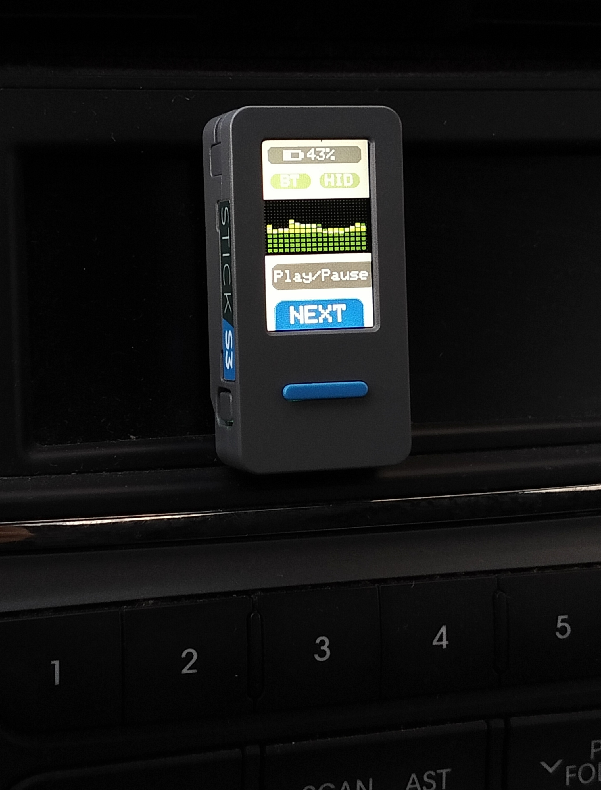

# VRStickS3

<p align="center">
  
</p>

A compact **M5StickS3 Bluetooth media remote** with HID media keys, battery status, LED feedback, and a Winamp-style microphone equalizer.


## Overview

**VRStickS3** turns an M5StickS3 into a small Bluetooth HID media controller.

It can be paired with a phone, tablet, PC, car media unit, or any device that accepts Bluetooth keyboard media keys. After pairing, the physical buttons send media commands while the screen shows connection status, battery level, and a live microphone-based equalizer.

## Features

- Bluetooth HID media control
- **Button A:** Next Track
- **Button B:** Play / Pause
- BLE/HID pairing status on screen
- Battery percentage header
- Winamp-style live equalizer using the built-in microphone
- Short blue LED pulse when a command is sent
- Reduced battery polling to lower power usage
- Optional bond clearing on boot by holding Button B
- IR output disabled to reduce unnecessary peripheral activity

## Hardware

- M5StickS3
- ESP32-S3 based M5Stack board

## Dependencies

Install these libraries in Arduino IDE:

- `M5Unified`
- `HijelHID_BLEKeyboard`

You also need the M5Stack ESP32 board package installed in Arduino IDE.

## Repository structure

```text
VRStickS3/
├── VRStickS3/
│   └── VRStickS3.ino
├── README.md
├── LICENSE
└── .gitignore
```

Arduino sketches should be stored in a folder with the same name as the `.ino` file:

```text
VRStickS3/VRStickS3.ino
```

## How to build and upload

1. Open `VRStickS3/VRStickS3.ino` in Arduino IDE.
2. Select the **M5StickS3** board.
3. Install the required libraries.
4. Connect the device over USB.
5. Compile and upload the sketch.
6. Pair the device from your phone, PC, tablet, or car media system as **VRStickS3**.

## Controls

| Button | Action |
|---|---|
| Button A | Next Track |
| Button B | Play / Pause |
| Hold Button B during boot | Clear BLE bonds and restart |

## Notes

- The Bluetooth device name is `VRStickS3`.
- If media commands are not accepted, remove the old Bluetooth pairing on the host device and pair again.
- If BLE range is unstable, increase `keyboard.setTxPower(2)` to `3` or `4`.
- The equalizer uses the built-in microphone and is intended as a visual audio activity display.

## Suggested GitHub description

A compact M5StickS3 Bluetooth HID media remote with Next Track, Play/Pause, battery status, LED feedback, and a Winamp-style microphone equalizer.

## Suggested GitHub topics

`m5stick-s3`, `m5stack`, `esp32-s3`, `arduino`, `ble-keyboard`, `hid`, `media-controller`, `bluetooth`, `equalizer`, `winamp`

## Inspired by
https://github.com/EnemyofGLaDOS/S3_Visualizer <br>
https://github.com/bmorcelli/Launcher

## License

This project is released under the MIT License.
